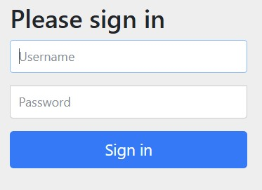
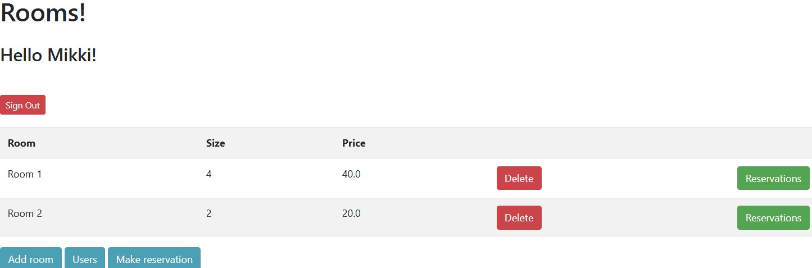
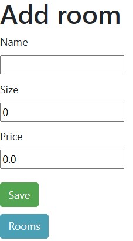
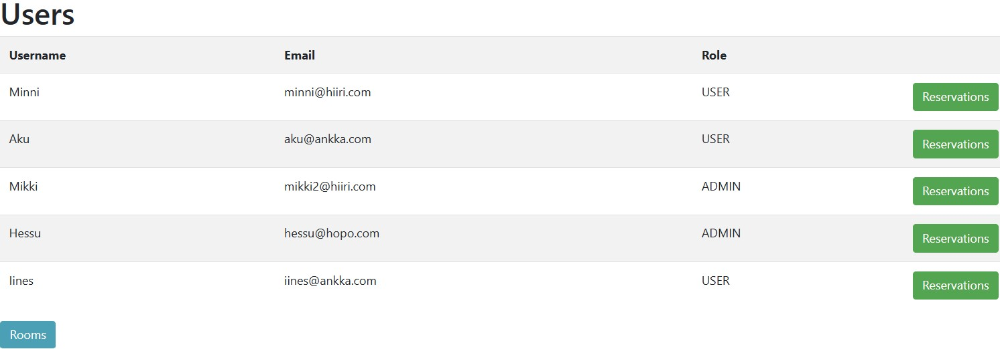

## Karaoke Rooms
A web service where users can rent rooms for karaoke sessions. Admin users have additional functionality to manage the service, such as adding rentable rooms. Users must sign in with a username and password to access the service.

### Features
- User authentication (username and password required)
- Room rental functionality
- Admin panel for managing rentable rooms

### Built with
- Java
- Spring Boot
- Thymeleaf
- Maven (via mvnw.cmd for build and dependency management)
- Bootstrap
- HTML

### Screenshots

Admin users view

User list view

